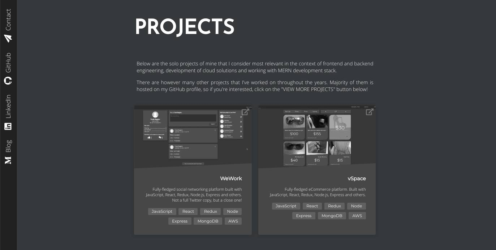

## Web address

Example app is hosted on [www.arkadyt.dev](https://arkadyt.dev).

## Description

This is my personal portfolio website project. It's built with pure React.js, SASS and JavaScript. Project's main focus is elegant visual design, simplicity of user interfaces, broad viewer device support and exploration of bleeding edge web technologies. Yep, it intentionally doesn't support IE.

Architecture of this application is very simple. App is written in pure React. Simple components, composition, custom React hooks and some React context.

You are more than welcome to fork this project and build something of your own on top of it! Following sections of this readme explain how to launch the application locally, deploy it and run tests.

## Running locally

To run locally, do:
```
git clone git@github.com:arkadyt/arkadyt.dev.git
cd arkadyt.dev && yarn && yarn start
```

## Running tests

```
# as simple as
yarn test
```

## Deploying the application

To deploy the application run `yarn deploy`. It will bundle up the app code and upload it to S3 using the `./client/deploy.sh` deployment script. You should configure the script and set up an S3 bucket before you deploy. After deployment you can serve content from S3 over CloudFront (recommended) or S3 Website Hosting feature.

Note: I recommend to set cache headers as follows:
* TTL of 1 year for media files like *.svg and *.webp,
* no-cache on index.html
* and 2 weeks for *.js and *.css files.

## License

```
The MIT License (MIT)

Copyright © 2020, Andrew Titenko

Permission is hereby granted, free of charge, to any person obtaining a copy of
this software and associated documentation files (the "Software"), to deal in
the Software without restriction, including without limitation the rights to
use, copy, modify, merge, publish, distribute, sublicense, and/or sell copies of
the Software, and to permit persons to whom the Software is furnished to do so,
subject to the following conditions:

The above copyright notice and this permission notice shall be included in all
copies or substantial portions of the Software.

THE SOFTWARE IS PROVIDED "AS IS", WITHOUT WARRANTY OF ANY KIND, EXPRESS OR
IMPLIED, INCLUDING BUT NOT LIMITED TO THE WARRANTIES OF MERCHANTABILITY, FITNESS
FOR A PARTICULAR PURPOSE AND NONINFRINGEMENT. IN NO EVENT SHALL THE AUTHORS OR
COPYRIGHT HOLDERS BE LIABLE FOR ANY CLAIM, DAMAGES OR OTHER LIABILITY, WHETHER
IN AN ACTION OF CONTRACT, TORT OR OTHERWISE, ARISING FROM, OUT OF OR IN
CONNECTION WITH THE SOFTWARE OR THE USE OR OTHER DEALINGS IN THE SOFTWARE.
```
